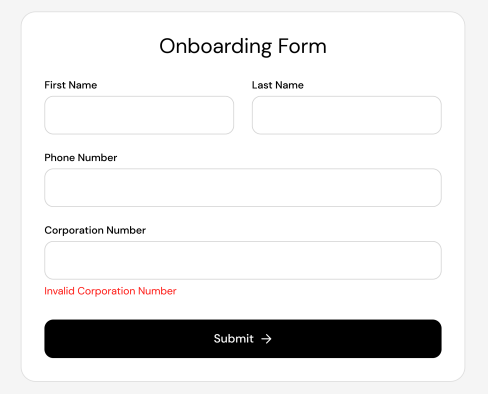

# Onboarding Form

A single-page onboarding form capturing a user's personal and business details, with synchronous field validation, asynchronous verification of the corporation number, and submission to a remote profile endpoint. see [Requirements.md](docs/Requirements.md).

## Design



## Getting Started

Requires Node 20+.

```bash
git clone <repo-url>
cd Onboarding-Form
npm install
cp .env.sample .env
npm run dev
```

## Scripts

| Script             | Description                                    |
| ------------------ | ---------------------------------------------- |
| `npm run dev`      | Start the Vite dev server                      |
| `npm run build`    | Type-check (`tsc -b`) and build for production |
| `npm run preview`  | Serve the production build locally             |
| `npm run lint`     | Run ESLint across the project                  |
| `npm test`         | Run tests in watch mode                        |
| `npm run test:run` | Run tests once — used in CI                    |

## Goals

- Collect and validate four fields: first name, last name, phone number, corporation number.
- Validate on blur, including a network round-trip for the corporation number.
- Block submission until every field is valid; surface per-field messages inline.
- POST a validated payload and report success or server-side failure to the user.
- Ship code that reads as production work: layered, DRY, typed, tested, accessible.

## Stack

| Concern             | Choice                                                 | Rationale                                                                                                                                                               |
| ------------------- | ------------------------------------------------------ | ----------------------------------------------------------------------------------------------------------------------------------------------------------------------- |
| Build / dev server  | Vite 8 + React 19 + TypeScript                         | Fast, minimal config                                                                                                                                                    |
| Form state          | React Hook Form                                        | Easy to use with validaton and formstate handling                                                                                                                       |
| Schema / validation | Zod 4 + `@hookform/resolvers`                          | One schema is the single source of truth for both runtime validation and the form's types.                                                                              |
| HTTP client         | axios                                                  | Defaults handle the API's mixed response formats                                                                                                                        |
| Async cache         | TanStack Query 5                                       | Used imperatively via `queryClient.query()` for corporation-number verification — supplies the result cache and in-flight dedup that make the submit-time re-check free |
| Styling             | Tailwind CSS v4 (Vite plugin)                          | Utility classes keep styling beside the markup in a single-screen app; build-time only, no runtime.                                                                     |
| Test runner         | Vitest + jsdom                                         | Shares the Vite transform pipeline — one config and aliases                                                                                                             |
| Component testing   | React Testing Library + user-event                     | Tests exercise the form the way a user does.                                                                                                                            |
| Network mocking     | MSW                                                    | Intercepts at the network layer, so production code under test uses its real request path.                                                                              |
| Linting             | ESLint (flat config) + typescript-eslint + react-hooks | Enforces hook rules                                                                                                                                                     |

## Architecture

Three layers, with a strict dependency direction: lower layers know nothing
about higher ones.

```
┌─────────────────────────────────────────────────────────┐
│  Presentation      OnboardingForm, TextField, Button    │
│                    Renders. Holds no business rules.    │
└────────────────────────────┬────────────────────────────┘
                             │ props / handlers
┌────────────────────────────▼────────────────────────────┐
│  Domain            useCorporationNumberCheck,           │
│                    useOnboardingForm,                   │
│                    onBoardingSchema, constants          │
└────────────────────────────┬────────────────────────────┘
                             │ typed function calls
┌────────────────────────────▼────────────────────────────┐
│  Data              api/clients, api/corporation-number, │
│                    api/onboarding-details               │
│                    Fetches.                             │
└─────────────────────────────────────────────────────────┘
```

## Data model

```ts
export type OnboardingFormTypes = z.infer<typeof onBoardingFormSchema>;
// {
//   firstName: string;
//   lastName: string;
//   phone: string;              // "+1XXXXXXXXXX" — transform output
//   corporationNumber: string;  // 9 digits
// }
```

## Implementation notes

- Phone accepts 10 digits and a Zod .transform() adds +1, rather than making the user type a country code they can't vary
- No libphonenumber-js — substantial metadata for a single-country form
- Corporation number verified via TanStack Query used imperatively, so the result cache makes the submit-time re-check free
- Why the submit-time re-check exists at all: handleSubmit re-runs the resolver and clears setError results
- A 4xx is a definitive answer (cached); a network failure isn't (retryable)
- No disable-until-submit (could be implemented by verifying scheme response)
- No loading state (not included in design, but could be implemented)
